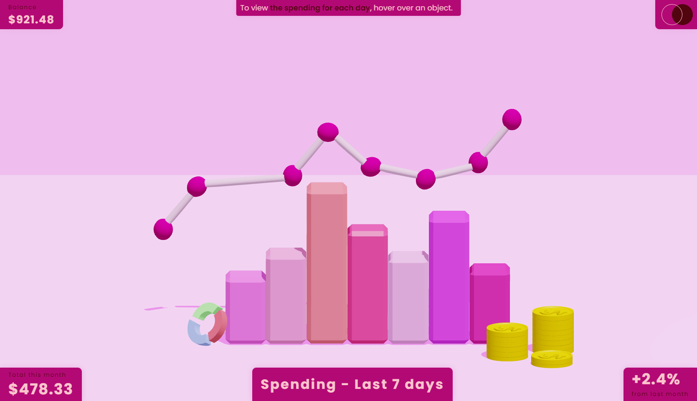
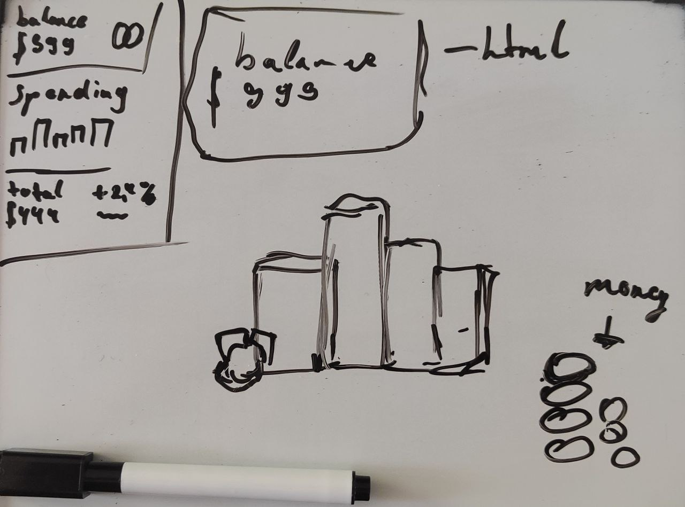

# Frontend Mentor 

This is a solution to the [Expenses chart component challenge on Frontend Mentor](https://www.frontendmentor.io/challenges/expenses-chart-component-e7yJBUdjwt). Frontend Mentor challenges help you improve your coding skills by building realistic projects. 

## Overview

First step in 3D world. It's far from perfection, but I hope u will like it.🦊

### Screenshot

### Links

- Solution URL: [O_o](https://github.com/Shadow-IO-oI/Expenses-chart-component)
- Live Site URL: [^_^](https://expenses-chart-component-woad.vercel.app/)

## My process

### Built with

- Semantic HTML5 markup
- CSS custom properties
- Flexbox
- GSAP
- Three.js
- Blender

## Author

- Frontend Mentor - [@Shadow-IO-oI](https://www.frontendmentor.io/profile/Shadow-IO-oI)

## Design Source 

