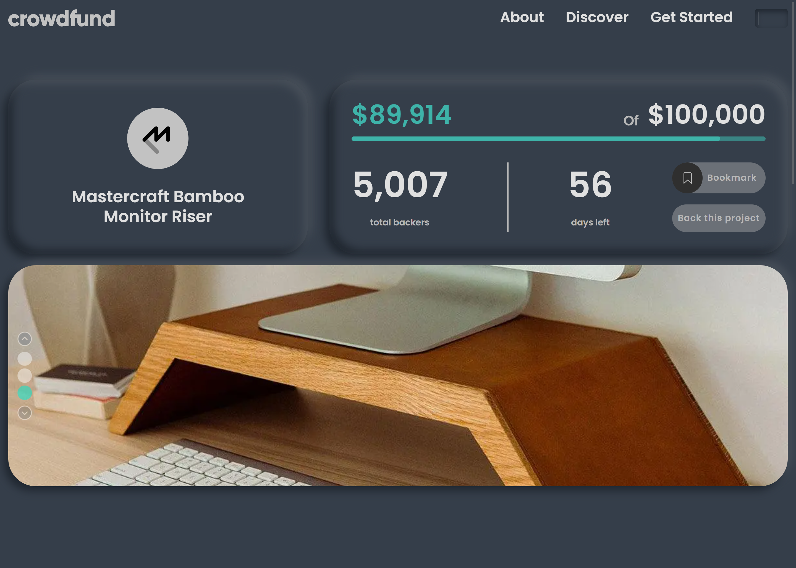
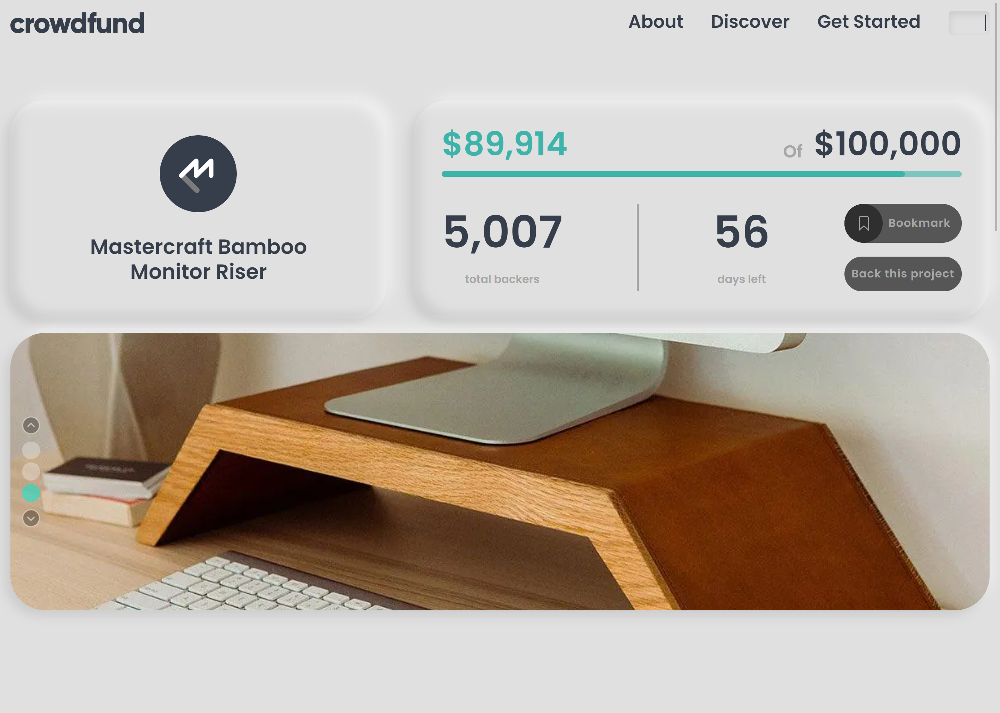

# Frontend Mentor - Crowdfunding product page solution

This is a solution to the [Crowdfunding product page challenge on Frontend Mentor](https://www.frontendmentor.io/challenges/crowdfunding-product-page-7uvcZe7ZR). Frontend Mentor challenges help you improve your coding skills by building realistic projects. 

## Overview

### Screenshot

#### Dark

#### Light

### Links

- Solution URL: [O_o](https://github.com/Shadow-IO-oI/crowdfunding-product-page)
- Live Site URL: [^_^](https://crowdfunding-product-page-murex-tau.vercel.app/)

## Additionally
If you want to create a similar page, you can download the additional Figma file that includes light and dark themes, hover effects, mobile views, and more. You can find it on my Patreon page.

- Patreon - [Boulevard of Fractions ](https://patreon.com/BoulevardofFractions) 

## Author

- Frontend Mentor - [@Shadow-IO-oI](https://www.frontendmentor.io/profile/Shadow-IO-oI)

